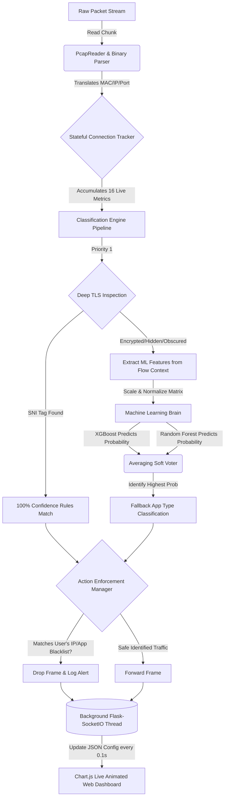

# 🚀 AI-Powered DPI Engine


A next-generation **Deep Packet Inspection (DPI)** engine built in Python. This project serves as a "smart traffic cop" for network data, using Machine Learning to identify, analyze, and optionally block internet traffic in real-time—even if the traffic tries to hide its identity!

---

## 📖 What is this project?
Whenever you use the internet (watching YouTube, scrolling TikTok, browsing websites), your computer sends and receives small chunks of data called **packets**. 

A standard router just passes these packets along. A **DPI (Deep Packet Inspection) Engine** opens them up, looks inside, and figures out exactly what app is generating the traffic so it can secure or manage the network. 

Traditional DPI engines rely on easy clues like Port numbers (e.g., Port 443 for HTTPS) or plain-text Server Names (SNI). But what happens when the traffic is heavily encrypted or trying to hide? **That's where the AI comes in.**

### 🤖 Why Machine Learning?
Instead of just looking for name tags, our ML model acts like a behavioral analyst. It analyzes **16 different behavioral features** of a data flow—such as how long the connection lasts, the variance in packet sizes, the speed (bytes per second), and the mathematical entropy (randomness) of the payload. 

By feeding this into a trained **RandomForest & XGBoost Ensemble Model**, the engine can accurately predict what app is running with high confidence, without ever needing to read the actual encrypted messages!

---

## ✨ Key Features

- **🧠 Smart AI/ML Classifier**: Falls back to an advanced Machine Learning model when traditional explicit detection (SNI) fails, boasting a 99%+ accuracy rate on training sets.
- **⚡ High-Performance Multi-Threading**: Designed for speed. A Load Balancer distributes incoming packets to multiple Fast-Path worker threads to ensure your network analysis never bottlenecks.
- **📊 Real-Time Web Dashboard**: A completely custom, dark-themed live dashboard built with Flask and Chart.js. Watch your network traffic get categorized, forwarded, and dropped live in your browser over WebSockets.
- **🛡️ Custom Firewall Rules**: Actively block unwanted traffic! You can block by Application (e.g., `TikTok`), IP Address, or specific Domain keywords.
- **📈 Comprehensive Extraction**: Extracts detailed flow metrics including exact TCP flag counts (SYN/ACK/FIN), inter-arrival timings, payload randomness, and more.
- **🎨 Sleek CLI Interface**: If you prefer the terminal, the engine features beautiful, color-coded live logs and auto-generated tracking reports summarizing all activity.

---

## 📸 See It In Action

### 1. Real-Time Web Dashboard
*(Drag and drop an image of your live dashboard running at localhost:5000 here)*
> *The dashboard provides a live breakdown of the applications consuming data, alongside immediate security red alerts if blocked traffic is intercepted.*

### 2. Terminal CLI Report
*(Drag and drop an image of the colored terminal output here)*
> *The terminal UI gives you raw packet-by-packet logs (if in verbose mode) and generates a beautiful aggregated end-of-run table.*

---

## 🚀 Quick Start Guide

Want to run this yourself? It takes less than 2 minutes to get the engine analyzing traffic!

### 1. Clone & Setup
```bash
# Clone the repository
git clone https://github.com/subham1533/dpi-engine.git

# Enter the directory
cd dpi-engine/dpi_engine

# Install the required Python packages
pip install -r requirements.txt
```

### 2. Generate Dummy Data
To test the engine, you need some network traffic (a `.pcap` file). Use our built-in script to generate a sample file with various types of mock traffic:
```bash
python generate_test_pcap.py
```
*This will create a file named `test_dpi.pcap` in your directory.*

### 3. Run the Live Dashboard
Let's fire up the engine and explicitly tell it to **Block YouTube**.
```bash
python dashboard/server.py test_dpi.pcap --block-app YouTube
```

### 4. Open the UI
Open your favorite web browser and navigate to:
👉 **[http://localhost:5000](http://localhost:5000)**

*(You can also run the terminal-only version using `python app.py test_dpi.pcap output.pcap --block-app YouTube`)*

---

## ⚙️ How it Works (Under the Hood)

## ⚙️ How it Works (Under the Hood)

### 🗺️ The Architectural Flow Diagram
The DPI Engine operates as a pipeline of independent, highly modular stages. This architecture guarantees that even though we are applying heavy machine learning logic to encrypted traffic, the engine never locks or slows down normal packet processing.



### 🧠 Step-by-Step Technical Deep Dive

#### 1. Binary Packet Ingestion & Parsing (`PcapReader` ➔ `PacketParser`)
The lifecycle of data analysis begins the moment a raw binary packet hits the `PcapReader`. Instead of reading heavy Python abstractions, the engine natively strips the first 16 bytes of the PCAP global header to establish exactly when a packet arrived down to the microsecond (`timestamp`). The remaining payload bytes are violently unrolled by `struct.unpack`, exposing the underlying Layer-2 Ethernet headers, Layer-3 IPs, and Layer-4 Transport ports. Crucial flags such as TCP `SYN`, `ACK`, and `FIN` are explicitly harvested by applying a hexadecimal bitmask against the transport offset.

#### 2. Stateful Connection Tracking (`ConnectionTracker`)
Because Machine Learning requires behavioral history (not just a single snapshot of data), we must remember who is talking to who. The engine groups packets into continuous conversational "Flows" using a normalized `FiveTuple` object (Source IP, Destination IP, Source Port, Destination Port, Protocol).

As every new packet arrives belonging to this flow, 16 distinct mathematical metrics are continuously calculated in real-time, including:
- **Packet Velocity**: The average `Packets Per Second` (pps) and `Bytes Per Second` (bps) are constantly sliding.
- **Statistical Size Distribution**: Running variance tracking allows us to calculate the **standard deviation** and **minimum/maximum** sizes of the packets (vital for recognizing structured streaming protocols like Netflix).
- **Communication Topology**: Entropy trackers evaluate the mathematical randomness of the raw bytes to confirm the presence of heavy TLS encryption handshakes.

#### 3. The Hybrid Detection Mechanism (`DPIEngine` + `MLPredictor`)
When it's time to classify the traffic, the pipeline bifurcates into a highly optimized dual-path structure:
- **Step A (The Fast Path)**: We first check if the upstream application has leaked its identity. The protocol payload is handed to the `SNIExtractor` which parses the TLS Client Hello message. If a domain string is found (like `www.youtube.com`), tracking is immediate: 100% exact confidence, resulting in an O(1) processing speed.
- **Step B (The Artificial Intelligence Path)**: When the traffic is deeply encrypted or obscuring its identity (as most modern applications do), there is no plain-text domain name to read. We seamlessly trigger our `MLPredictor`. 
The 16 metrics collected in the `ConnectionTracker` are serialized into a heavily scaled NumPy Array. This matrix is blasted into an ensemble mapping combining a highly trained **XGBoost Classifier** alongside a resilient **RandomForest Tree Matrix**. The algorithm assesses behavioral signatures mapping to thousands of distinct app profiles in micro-seconds. The probabilities are merged via soft voting to return the highest possible predicted App (alongside an exact math-based confidence score, e.g., `87.5% confidence`).

#### 4. Active Constraint Enforcement (`RuleManager`)
The resulting Application signature, regardless of whether it was derived from an SNI read or predicted via XGBoost, is handed immediately to the `RuleManager`. The system runs a high-speed matching sequence against your supplied CLI blacklist configurations. Any packet matching your `--block-app`, `--block-ip`, or `--block-domain` parameters is natively barred from being serialized into the output feed, effectively serving as an impenetrable firewall layer.

#### 5. Front-End Serialization & Visualization (`Flask SocketIO`)
Every decision logged by the system doesn't just disappear into standard output. During the packet loop, a background daemon safely acquires a non-blocking `threading.Lock()` against the central packet statistics mapping. Every fraction of a second, the statistics are collapsed into a JSON footprint containing the total speeds, application counts, and string-formatted security alerts. 
This JSON block is thrust natively through a `Flask-SocketIO` WebSocket bridge to `http://localhost:5000`. The client's React-styled `Chart.js` UI captures the emission, natively re-rendering the graphical contexts directly in front of your eyes without ever reloading the HTML framework.

---

## 📂 Project Architecture

```text
dpi_engine/
├── dashboard/                   # The Real-Time Web Application
│   ├── static/charts.js         # Chart.js interactive websocket logic
│   ├── templates/index.html     # The beautiful styling for the UI
│   └── server.py                # Flask server connecting the DPI to the Web
├── ml/                          # The Artificial Intelligence Brain
│   ├── model/dpi_model.pkl      # The compiled, trained ensemble weights
│   ├── dataset_generator.py     # Creates thousands of synthetic flow patterns
│   ├── feature_extractor.py     # Funnels raw packet stats into 16-element arrays
│   ├── predictor.py             # Predicts traffic in real-time using the models
│   └── trainer.py               # Learns from the dataset and generates accuracy metrics
├── src/                         # The Core High-Performance Engine
│   ├── connection_tracker.py    # Tracks which packets belong to which user conversation
│   ├── dpi_engine.py            # The main traffic director
│   ├── dpi_mt.py                # Spins up multi-threaded Load Balancers & Workers
│   ├── packet_parser.py         # Bit-level translation of network frames
│   ├── pcap_reader.py           # Safely handles large binary file streams
│   └── rule_manager.py          # Decides what gets blocked vs forwarded
├── app.py                       # The classic Terminal interface for the engine
└── generate_test_pcap.py        # Utility to build fake data for testing
```

---

## 🛠️ The Tech Stack

| Component | Technology Used | Why? |
|-----------|----------------|------|
| **Core Engine** | Python 3 | Highly readable, excellent for stringing data pipelines together. |
| **Machine Learning** | Scikit-Learn, XGBoost | The industry standard for tabular/matrix classification tasks. |
| **Network Tools** | Scapy | Makes generating raw `.pcap` files incredibly easy. |
| **Web Server** | Flask, Flask-SocketIO | Lightweight web frameworks that support continuous real-time streaming natively. |
| **Frontend UI** | HTML5, TailwindCSS, Chart.js | Allows for gorgeous, responsive, and animated data monitoring. |

---

## 👨‍💻 About the Author

**Subham**  
Passionate about software engineering, networks, and building robust backend infrastructure. 

🔗 [Let's connect on LinkedIn](https://www.linkedin.com/in/subham-tomar-b03b66363/)  
🐙 [Check out my other projects on GitHub](https://github.com/subham1533)
